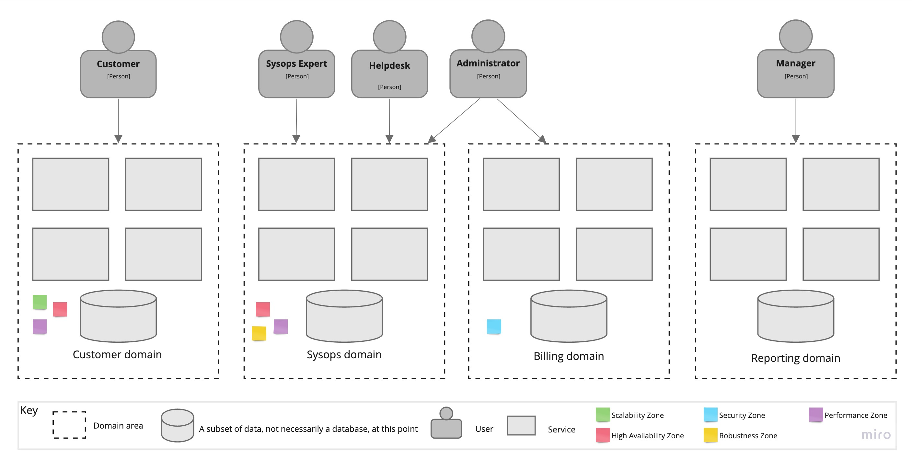

# ADR-1: Использование сервисно-ориентированного архитектурного стиля в качестве основного стиля

## Статус

Предложено

## Контекст

Когда компания была небольшим бизнесом, она могла быть удовлетворена монолитным приложением. Однако, по мере роста бизнеса до масштабов страны, компании теперь необходимо распределенное решение, чтобы оставаться на рынке.

## Решение

Мы обнаружили четыре основных области доменов, каждая из которых имеет свои собственные группы архитектурных характеристик:

- **Customer-facing** Сервисы, предоставляемые непосредственно клиентам, такие как подача заявок на техническую поддержку и управление профилями. Важно обеспечить высокую доступность и производительность для этой части системы, так как медленная или недоступная система может серьезно разочаровать клиентов. Кроме того, эта часть системы должна быть масштабируемой, так как увеличение числа клиентов является ключевым фактором успешного бизнеса. Клиентская зона может быть изолирована в отдельной сетевой зоне, где разрешены только входящие запросы, что повышает уровень безопасности.
- **Operational processes** Операционные процессы, такие как работа с базой знаний и обработка заявок. Если эксперт не сможет найти заявку или статью в базе знаний, когда прибудет к месту клиента, он может быть не в состоянии решить проблему. Эта подсистема также требует высокой доступности и производительности.
- **Billing services** Сервисы по выставлению счетов. Здесь речь идет о деньгах клиентов. Если злоумышленник получит доступ к информации о кредитных картах, это может стать катастрофой и иметь юридические последствия. Эта часть системы может потребовать сертификации PCI, поэтому ее изоляция от остальной системы значительно упростит эту процедуру. Это изолированная зона безопасности, не принимающая входящие запросы из других доменов.
- **Administration services** Службы администрирования, такие как управление пользователями, аналитика и отчетность. Эти сотрудники выполняют очень важную работу, но ничего критического не произойдет, если генерация отчета займет немного больше времени или администратор обновит профиль эксперта с задержкой из-за технических работ. Здесь также важна безопасность, поскольку учетные данные администратора не должны быть подвержены риску, однако уровень безопасности отличается от требуемого для системы выставления счетов.

Это заставляет нас задуматься о создании отдельной архитектурной кванта для каждого из этих четырех доменов, и сервисно-ориентированный подход кажется хорошим решением. Предлагаемый подход обладает надежностью, масштабируемостью и гибкостью, несопровождаемыми дополнительными затратами, характерными для подхода на микросервисы.

Другой важный момент, который стоит упомянуть, заключается в том, что стиль, основанный на сервисах, является хорошей отправной точкой для постепенной миграции от монолитной архитектуры к высокораспределенной архитектуре, такой как микросервисы, если потребуется новый уровень масштабируемости.

## Последствия

- Это может потребовать разделения базы данных.
- Потребуется обучение команд продукта о границах и обязанностях доменов.
