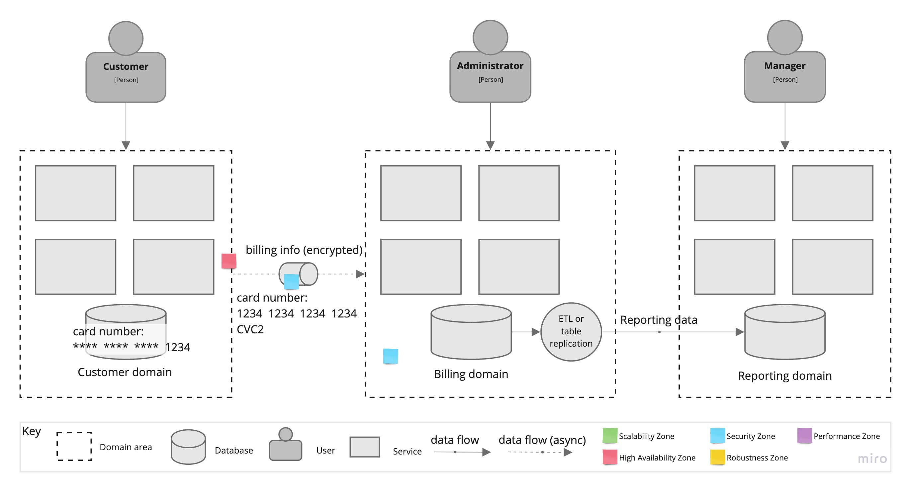

# ADR-4: Извлечение биллингового архитектурного кванта

## Статус

Предложенный

## Контекст

Биллинговый архитектурный квант имеет особые требования к безопасности, существенно отличающиеся от остальной системы. Поскольку мы храним информацию о кредитных картах клиентов в базе данных (см. ASM-4), система может потребоваться пройти аудит от Payment Card Industry (PCI). Чем больше часть системы работает с данными кредитных карт, тем более трудоемкой становится процедура.  
Изолировать всю процедуру биллинга в отдельный архитектурный квант имеет смысл (как уже упоминалось в [ADR-1](ADR/ADR-1-service-based.md)). Теперь давайте решим, как мы это сделаем.

## Решение

Проблема с изоляцией подсистемы биллинга заключается в том, что данные биллинга требуются другим частям системы:

- клиенты хотят вводить и редактировать информацию о своем платеже, включая данные кредитной карты;
- администраторы должны иметь доступ к системе биллинга для решения вопросов обработки платежей;
- менеджеры хотят видеть финансовые отчеты.

Сначала определим, что включаем в биллинговый архитектурный квант.

Давайте решим эти проблемы поочередно. Нужно ли клиентам видеть все детали своего платежа для их редактирования, такие как номер карты, срок действия или CVC2-код? Конечно, нет. Достаточно отображать последние 4 цифры номера кредитной карты, например, чтобы клиент мог удалить существующую карту и добавить новую с полной информацией.
Когда клиент вводит данные кредитной карты в пользовательском интерфейсе, мы сразу передаем их в биллинговый квант и сохраняем только последние 4 цифры номера кредитной карты в пользовательском кванте, оставляя все детали в безопасности в биллинговом кванте. Клиенту не нужно ждать обработки кредитной карты биллинговой системой, поэтому мы можем передавать данные асинхронно через очередь сообщений, тем самым улучшая время отклика.

Администраторы получат доступ к информации о биллинге через интерфейс биллинга. Как дополнительная мера безопасности, биллинговый квант может быть скрыт от остального мира за виртуальной сетью, и администраторы будут должны использовать VPN-клиент для доступа к нему.

Для менеджеров у нас есть два варианта. Они также могут получить доступ к интерфейсу биллинга для анализа финансовых отчетов так же, как администраторы. Или, если мы придерживаемся отдельного кванта для отчетности и аналитики, данные биллинга, необходимые для отчетности, могут быть реплицированы в этот квант на уровне таблиц. В случае, если мы хотим использовать разные базы данных для каждого из этих квантов, вместо этого можно использовать фоновую задачу ETL, работающую в биллинговом кванте, и передавать данные отчетности на другую сторону.

## Последствия

- Усложнение.
- Необходимо обеспечить безопасность передачи данных кредитных карт между квантами. Брокеры сообщений обычно поддерживают протоколы TLS, контроль доступа и аутентификацию, но это требует дополнительных усилий при разработке.
