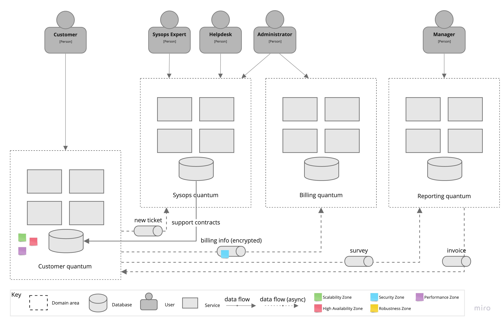

# ADR-5: Извлечение архитектурного кванта клиента

## Статус

Предложенный

## Контекст

Улучшение отзывчивости и доступности сервисов, предоставляемых клиентам.

По мере роста бизнеса, увеличивается количество клиентов, использующих систему, поэтому нам необходимо сохранить характеристики производительности при масштабировании.

## Решение

Сложность здесь заключается в том, что клиенты взаимодействуют довольно тесно с другими частями системы, в частности:

- **UC-2 контракты поддержки**: клиенты должны выбрать из доступных контрактов поддержки при составлении своих планов поддержки;
- **UC-2 информация о платежах**: система должна перемещать данные кредитных карт в безопасное место;
- **UC-3 подача заявки**: клиенты подают свои заявки на обработку другой частью системы;
- **UC-4 подача опросов**: клиенты должны будут отправлять опросы с отзывами, которые необходимы для аналитики;
- **UC-7 получение счетов**: при выставлении счетов клиенты должны получать счета.

Новые контракты поддержки или изменения контрактов поддержки не являются событиями, требующими немедленной реакции, поэтому мы можем оставить это для репликации на уровне таблицы. Это может быть встроенная функция базы данных или, если мы хотим избежать связанности на уровне базы данных, это может быть фоновая задача ETL, которая запускается периодически и синхронизирует информацию о контрактах поддержки между квантами.

Поскольку мы не храним конфиденциальную информацию о кредитных картах в кванте клиента (см. [ADR-4](ADR/ADR-4-extract-billing-quanta.md)), нам нужно безопасно переместить эту информацию в биллинговый квант. Если делать это синхронно (через REST API или RPC-вызов), мы потеряем преимущества масштабируемости и доступности для кванта клиента, поэтому мы воспользуемся асинхронной передачей сообщений.

То же самое относится к подаче заявки на обработку - мы не хотим заставлять клиента ждать, пока заявка будет взята в обработку, поэтому это просто сообщение "отправить и забыть".

С другой стороны, подача опросов не является событием, требующим немедленной реакции, поэтому здесь может подойти репликация на уровне таблиц. Однако, поскольку опросы с отзывами необходимы только для аналитики, нам не нужно хранить эти опросы в кванте клиента, поэтому мы также можем асинхронно передавать их в соответствующий квант.

Когда задача по выставлению счетов генерирует счет, ей не обязательно ждать отправки счета клиенту. Или, если система уведомлений недоступна (например, из-за проведения технических работ), мы не хотим, чтобы какие-либо счета были пропущены; клиенты в конечном итоге должны получить свои счета. По этой причине мы будем использовать постоянную очередь сообщений для отправки счетов между биллинговым и клиентским квантами.

Все вместе:

