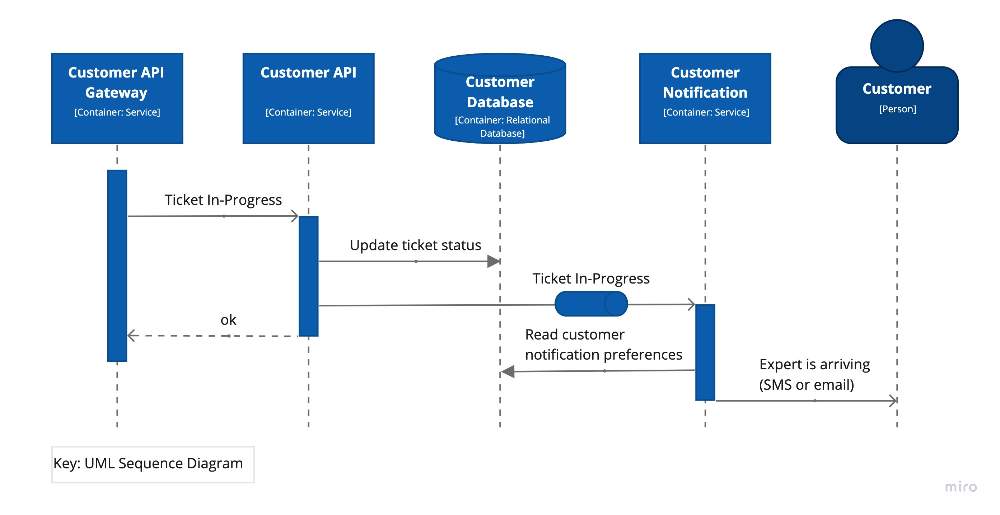
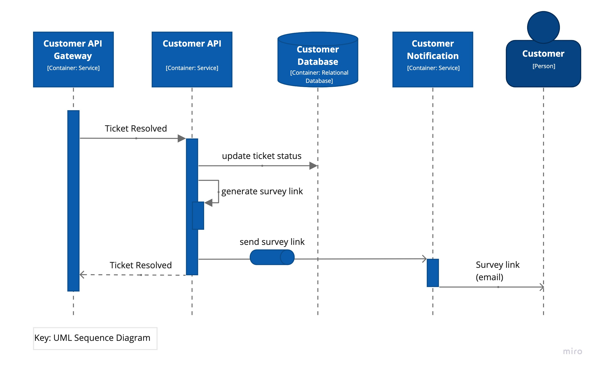

# Архитектурное ката Sysops Squad, автор O'Reilly, апрель - май 2021г

## Команда семь

**Pavel, Suheyl, Nikita, Hassan**

## Содержание

- [Добро пожаловать](#добро-пожаловать)
  - [О названии](#о-названии)
- [Бизнес-кейс](#бизнес-кейс)
- [Системные требования](#системные-требования)
  - [Функциональные требования](#функциональные-требования)
  - [Архитектурные требования](#архитектурные-требования)
  - [Ограничения](#ограничения)
  - [Допущения](#допущения)
- [Текущая архитектура](#текущая-архитектура)
- [Целевая архитектура](#целевая-архитектура)
  - [Модель использования (Use Case Model)](#модель-использования-use-case-model)
  - [Контекст системы (System Context)](#контекст-системы-system-context)
  - [Контейнеры (Containers)](#контейнеры-containers)
  - [Представления процессов (Process Views)](#представления-процессов-process-views)
  - [Развертывание (Deployment)](#развертывание-deployment)
- [Архитектура переходного периода (Transition Architecture)](#архитектура-переходного-периода-transition-architecture)
- [Architecture Decision Records](#architecture-decision-records)

## Добро пожаловать

> _Все в архитектуре программного обеспечения является компромиссом.  
> Первый закон архитектуры программного обеспечения_

Добро пожаловать на Архитектурный ката Sysops Squad, проводимый компанией O'Reilly в апреле - мае 2021 года.

Эта страница представляет собой архитектурную документацию для предложения решения от **Команды Семь**.

### О названии

Magic number Seven... This is not a random number in our name. This number joined our team together. One of us has a birthday at 07/07 thus joined the Team Seven. Somebody had a successful career in a football team under number 7 thus joined the Team Seven. Somebody believes that this is his lucky number throughout the whole life.  
And of course, the average number of services in Service-based architecture that we defined as our initial candidate, is about 7.
That's why we decided to make this number a symbol of our team.

## Бизнес-кейс

Penultimate Electronics - это крупный электронный гигант, у которого имеется множество розничных магазинов по всей стране. Когда клиенты покупают компьютеры, телевизоры, стереосистемы и другую электронную технику, они могут выбрать план поддержки. Технические эксперты, работающие с клиентами («Sysops Squad»), затем приезжают на дом клиента (или в офис) для устранения проблем с электронным устройством.

Существующая система управления заявками представляет собой большое монолитное приложение, разработанное много лет назад. Клиенты жалуются, что консультанты никогда не приходят из-за потерянных заявок, а часто приходит неправильный консультант, который не разбирается в проблеме. Клиенты и сотрудники колл-центра жалуются, что система не всегда доступна для ввода заявок через веб или звонки. Внесение изменений в этот большой монолит является сложным и рискованным процессом - каждое изменение занимает слишком много времени, а часто что-то ломается. Из-за проблем с надежностью монолитная система часто "зависает" или выходит из строя - это обычно происходит из-за резкого увеличения использования и числа клиентов, пользующихся системой. Если что-то не будет сделано в ближайшее время, Penultimate Electronics будет вынуждена отказаться от этой очень прибыльной линии бизнеса и уволить всех экспертов.

Желаемое решение с функциональной точки зрения представлено на следующей диаграмме marketecture.

**Бизнес-факторы**

Какие бизнес-факторы мы можем выявить из данной ситуации:

- Низкая производительность системы отслеживания заявок.
- Возможность полного прекращения данной линии бизнеса.
- Многие люди находятся под угрозой потери своих рабочих мест.

**Бизнес-цели**

Компания устанавливает следующую бизнес-цель для улучшения ситуации:

- Разработать новую систему отслеживания заявок, которая будет удовлетворять требуемым характеристикам.

Компания страдает от неэффективной системы поддержки клиентов, что может привести к прекращению данной линии бизнеса. Они хотят разработать новую надежную и высокопроизводительную систему, которая позволит им остаться в бизнесе и обеспечить будущий рост.

## Системные требования

### Заинтересованные стороны (Stakeholders)

В этом разделе описываются ключевые заинтересованные стороны системы и их архитектурные проблемы.

- **SH-1**: **Администратор (Administrator)** (security)

  - безопасность - это второе имя администратора; эти люди занимаются учетными записями пользователей и системой выставления счетов.

- **SH-2**: **Клиент (Customer)** (availability, performance, scalability, robustness)

  - клиенты хотят, чтобы система, к которой они обращаются, была доступна в любое время, когда им нужно ее использовать, и чтобы она быстро реагировала на их действия;
  - они также не хотят, чтобы их заявки обрабатывались и не терялись.

- **SH-3**: **Эксперт (Expert)** (availability, performance)

  - каждый раз, когда эксперт работает на месте, успех разрешения проблемы может зависеть от того, имеет ли он доступ к базе знаний системы заявок;
  - неэффективная система может существенно влиять на разрешение проблемы и тратить время клиента и эксперта.

- **SH-4**: **Менеджер (Manager)** (reportability)

  - данным людям необходимо тщательно следить за происходящим: есть ли недовольные клиенты, заявки, для которых слишком долго не назначается эксперт, возникли ли какие-либо проблемы с выставлением счетов и т.д.

- **SH-5**: **Служба технической поддержки (Helpdesk)** (availability, performance)

  - это первая линия поддержки для клиентов, поэтому им необходимо иметь доступ к статьям по устранению неполадок и заявкам клиентов во время звонков;
  - они предоставляют прямую телефонную поддержку, поэтому ответы должны быть найдены как можно быстрее.

- **SH-6**: **Команда разработки (Development team)** (extensibility)
  - у этих специалистов возникают сложности с развертыванием изменений в продакшн-среде из-за высокой связности и недостаточной модульности текущей системы.

### Функциональные требования

- **UC-1**: **Управление пользователями**:

  - Администратор поддерживает внутренние учетные записи пользователей (SH-1);
  - Администратор поддерживает навыки, местоположение и доступность экспертов (SH-1);

- **UC-2**: **Регистрация клиента**:

  - Клиенты регистрируют свои профили, кредитные карты и планы поддержки (SH-2);

- **UC-3**: **Рабочий процесс заявок**:

  - Клиенты отправляют заявки через веб-интерфейс или по телефону (SH-2, SH-5);
  - Эксперты используют мобильное приложение для чтения заявок и изменения их статуса (SH-3);
  - Эксперты могут использовать мобильное приложение для поиска в базе знаний (SH-3);

- **UC-4**: **Отправка опросов**:

  - Клиенты заполняют и отправляют опросы о удовлетворенности (SH-2);

- **UC-5**: **Обновление базы знаний**:

  - Эксперты обновляют базу знаний (SH-3);

- **UC-6**: **Формирование отчетов**:

  - Менеджеры отслеживают операции с заявками (SH-4);
  - Менеджеры создают отчеты: финансовые, о производительности экспертов, о заявках (SH-4);

- **UC-7**: **Выставление счетов**:

  - Клиентам автоматически выставляются счета ежемесячно (SH-2);
  - Клиенты могут просматривать историю и выписки по счетам (SH-2);
  - Администратор управляет процессом выставления счетов для клиентов (SH-1);

- **UC-8**: **Уведомления**:

  - Клиенты получают SMS или электронное письмо о назначении эксперта (SH-2);
  - Клиенты получают электронное письмо с ссылкой на веб-форму опроса (SH-2);
  - эксперты получают SMS-уведомление о назначении заявки (SH-3);

- **UC-9**: **Поиск заявок**:
  - Сотрудникам службы технической поддержки необходим доступ к базе заявок для уточнения их статуса (SH-5);

### Архитектурные требования

- **QA-1**: **доступность (scalability)** (UC-3)

  - География национального масштаба (США?);
  - Количество клиентов - миллионы;
    Количество заявок на клиента <= 100 (допустим, что-то экстремальное);

- **QA-2**: **доступность (availability)** (UC-2, UC-3, UC-4)

  - Клиентские сервисы и база знаний должны быть высокодоступными, поскольку сбои окажут негативное влияние на бизнес;
  - 99,9% кажется разумным в данном случае;

- **QA-3**: **производительность (performance)** (UC-2, UC-3, UC-6)

  - Время отклика < 2 секунд для загрузки страницы;
  - Время поиска в базе знаний несколько секунд;
  - Генерация отчетов не должна занимать чрезмерное количество времени;

- **QA-4**: **надежность (robustness)** (UC-3)

  - Потерянные заявки или неправильно назначенные эксперты могут привести к закрытию бизнеса;

- **QA-5**: **безопасность (security)** (UC-2, UC-7)

  - Личная информация клиентов и данные кредитных карт должны храниться в безопасном и соответствующем требованиям PCI формате;

- **QA-6**: **расширяемость (extensibility)** (all use cases, SH-6)
  - Одна из ключевых проблем текущей системы заключается в том, что внесение изменений занимает слишком много времени, а что-то обычно ломается. Это заставляет задуматься о улучшенной модульности новой системы.

### Ограничения

- **CON-1**: Интеграция? Облако/локальное развертывание? Стек технологий?

### Допущения

- **ASM-1**: Мобильное приложение является частью системы и может быть изменено.
- **ASM-2**: Помощники службы поддержки (также известные как колл-центр) нуждаются в доступе к подсистеме заявок и некоторой информации о клиентах (контакты, возможно, информация о поддержке). Они также являются пользователями системы, хотя и не указаны в "Основных четырех пользователях" изначальных требований.
- **ASM-3**: Система отслеживания вызовов (call tracking system) не является частью системы Sysops Squad.
- **ASM-4**: Компания хранит информацию о кредитных картах клиентов локально и не взаимодействует с третьей стороной (например, authorize.net в США).

## Текущая архитектура

В данном разделе описывается архитектура текущей системы заявок.

Обратите внимание, что все представления документируются в стиле [C4 model](https://c4model.com), хотя представлены только системная контекстная, контейнерная и динамическая представления. Большинство диаграмм используют неформальный стиль обозначений. Все диаграммы сопровождаются легендой, объясняющей значение каждой формы на диаграмме.

Текущая система заявок проявляет очень слабые характеристики доступности, поддерживаемости, развертываемости и производительности. Нашей целью является разработка новой системы, которая решает вышеупомянутые проблемы.

Далее изображена диаграмма контейнеров текущей системы заявок:

## Целевая архитектура

В данном разделе описывается целевая архитектура программного обеспечения.

Обратите внимание, что все представления документируются в стиле [C4 model](https://c4model.com), хотя представлены только системная контекстная, контейнерная и динамическая представления. Большинство диаграмм используют неформальный стиль обозначений. Все диаграммы сопровождаются ключом, объясняющим значение каждой формы на диаграмме.

### Модель использования (Use Case Model)

На следующей диаграмме показано соответствие требований к архитектурным характеристикам к основным случаям использования на основе [требований](Requirements.md):

### Контекст системы (System Context)

Диаграмма контекста системы ниже отображает основных пользователей системы и ее внешние зависимости:

### Контейнеры (Containers)

Следующая диаграмма контейнеров показывает общую структуру архитектуры программного обеспечения и распределение ответственности между контейнерами. Она также показывает основные технологические выборы и способы взаимодействия между контейнерами.

Архитектура построена вокруг четырех основных доменов, которые были обнаружены во время анализа проблемы:

- (customer-facing) отправка заявок, профили клиентов, отправка опросов и т. д.;
- (expert services) принятие заявок и поиск в базе знаний;
- (administration services) отчетность, анализ опросов, отслеживание заявок и т. д.;
- (billing service) выставление счетов, требует особого внимания к безопасности.

Используемый здесь архитектурный стиль - это сервисно-ориентированная архитектура (см. [ADR-1](ADR/ADR-1-service-based.md) для получения подробностей).

### Представления процессов (Process Views)

В данном разделе объясняются некоторые ключевые случаи использования для демонстрации того, как соответствующие рабочие процессы проходят через контейнеры.

#### UC-2: Регистрация клиента

Следующая диаграмма последовательности подчеркивает некоторые ключевые запросы, которые клиент выполняет во время регистрации в системе. Особое внимание следует уделить регистрации кредитной карты. В базе данных клиентов мы храним только минимальные данные кредитной карты, чтобы клиент мог определить, какая карта уже зарегистрирована. Все данные о кредитной карте зашифрованы и безопасно передаются в систему биллинга (см. [ADR-4](ADR/ADR-4-extract-billing-quanta.md)).

#### UC-3: Подача заявки на техническую поддержку

Следующая диаграмма иллюстрирует процесс регистрации заявки на техническую поддержку клиентом.

Важно отметить, что запрос успешно выполняется после сохранения заявки в базе данных клиента и генерации соответствующего события для области обработки заявок. Таким образом, клиент сможет видеть новую заявку сразу после обновления страницы и не будет ждать дополнительных действий по заявке.

#### UC-3: Назначение заявки

Диаграмма ниже объясняет, как система обрабатывает новую заявку и назначает на нее эксперта.

Поскольку обработка заявок - это задание, которое выполняется периодически, заявки, которые в данный момент не могут быть назначены, никогда не будут потеряны и будут обработаны при следующем запуске задания.

Также обратите внимание, что назначение является отдельной сущностью. Таким образом, мы можем хранить историю назначений.

#### UC-3: Принятие заявки

Эта диаграмма продолжает рабочий процесс заявки и показывает, как обрабатывается событие "Заявка назначена" пользователем Sysops Expert.

Операция эксперта выполняется сразу после сохранения статуса заявки в базе данных. И в случае принятия заявки генерируется соответствующее событие для области клиента.

#### UC-3: Заявка в процессе выполнения

Эта диаграмма демонстрирует, как клиент уведомляется о том, что заявку принял Sysops Expert.

Важно отметить, что заявка сохраняется в базе данных клиента перед событием уведомления, чтобы клиент увидел фактический статус заявки после получения уведомления.

#### UC-3: Завершение заявки

Эта диаграмма объясняет процесс, когда Sysops Expert решает проблему и помечает заявку как завершенную.

#### UC-3: Заявка решена

Эта диаграмма иллюстрирует, как клиент получает уведомление о разрешении заявки и ссылку на форму опроса.

Сначала статус заявки должен быть обновлен в базе данных клиента, чтобы клиент увидел фактический статус заявки на портале клиента при получении уведомления.

#### UC-4: Отправка опроса

И, наконец, последний шаг в потоке разрешения заявки - отправка опроса клиентом.

С точки зрения клиента, это событие "записать и забыть", поэтому операция выполняется сразу после нажатия кнопки "Отправить".

API аналитики может выполнять предварительную обработку опроса при необходимости или просто хранить его в базе данных для отчетности.

#### UC-7: Ежемесячное выставление счетов

Диаграмма иллюстрирует процесс ежемесячного выставления счетов.

Диаграмма развертывания показывает, как контейнеры системы отображаются на инфраструктуру:

Обратите внимание, что цвета не имеют особого значения, они просто используются для различения элементов друг от друга.

Стратегия развертывания здесь является облачно-независимой и предполагает, что вы можете использовать любого облачного провайдера по вашему выбору или оставаться полностью внутри предприятия. Исключение составляют элементы биллинга, которые рекомендуется все равно оставить внутри предприятия из соображений безопасности.

## Архитектура переходного периода (Transition Architecture)

Решение, предложенное в разделе [Целевая архитектура](#целевая-архитектура), является окончательной целью, которая решает большинство проблем и рисков, но может потребовать значительных усилий для разработки из-за необходимости разделения базы данных. Поэтому мы можем разделить всю работу на две фазы:

1. Решение критических проблем и использование монолитной базы данных до тех пор, пока она не станет узким местом.
2. Дальнейшая миграция к целевой архитектуре для решения всех оставшихся рисков.

Вот предложение по архитектуре переходного периода, которое решает критические проблемы, но оставляет некоторые риски (анализ приведен ниже).
Обратите внимание, что мы все еще используем асинхронное сообщение для обработки заявок на обслуживание, чтобы обеспечить независимое масштабирование и доступность разных частей системы. В этом случае сообщения могут содержать гораздо меньше информации, потому что все детали могут быть получены получателем из базы данных.

Поскольку у нас есть единая монолитная база данных, мы можем сэкономить некоторые усилия на дополнительной маршрутизации сообщений и репликации.

### Risk Analysis

These are the possible high risks of the transition architecture.

#### Performance

Because this is a monolithic database it can become a performance bottleneck. The same concern regarding the single API Gateway - if not scaled properly may also become a bottleneck.

#### Availability

A single API Gateway may introduce a single point of failure for the whole system (see [ADR-12](ADR/ADR-12-gateways.md)).

#### Security

There is a risk that admin staff can get access to the customer credit card data. We certainly want to prevent that by extracting billing into a separate architectural quantum (see [ADR-4](ADR/ADR-4-extract-billing-quanta.md)) and isolating it in a separate network zone with strict access permissions.

The same concern is regarding the customer services - we don't want to allow an attacker to get access to the reset of the system. A significant security improvement would be to migrate customer services and data in a separate quantum in isolate it in a separate network zone (see [ADR-5](ADR/ADR-5-extract-customer-quantum.md)).

#### Other

Additional concerns regarding the API Gateway:

- Adds coupling between the gateway and the internal service.
- If developed by a single development team, may become a development bottleneck.

## Architecture Decision Records

> _Why is more important than how.  
> Second Law of Software Architecture_

- [ADR-1](ADR/ADR-1-service-based.md) Use Service-based architectural style as the basic style.
- [ADR-2](ADR/ADR-2-event-driven-broker.md) Use message queues with guaranteed delivery for ticket workflow.
- [ADR-3](ADR/ADR-3-search-expert.md) Extract ticket assignment into a separate batch processing job.
- [ADR-4](ADR/ADR-4-extract-billing-quanta.md) Extract billing architectural quantum.
- [ADR-5](ADR/ADR-5-extract-customer-quantum.md) Extract customer architectural quantum.
- [ADR-6](ADR/ADR-6-separate-customer-db.md) Use separate customer database.
- [ADR-7](ADR/ADR-7-separate-reporting-db.md) Separate analytics and reporting database.
- [ADR-9](ADR/ADR-9-notification-service.md) Extract notification service.
- [ADR-10](ADR/ADR-10-modular-services.md) Use sub-domain partitioning for service design.
- [ADR-11](ADR/ADR-11-extract-payment-job.md) Extract payment processing into a separate component (Payment Job).
- [ADR-12](ADR/ADR-12-gateways.md) Offload operational concerns into API Gateways.
